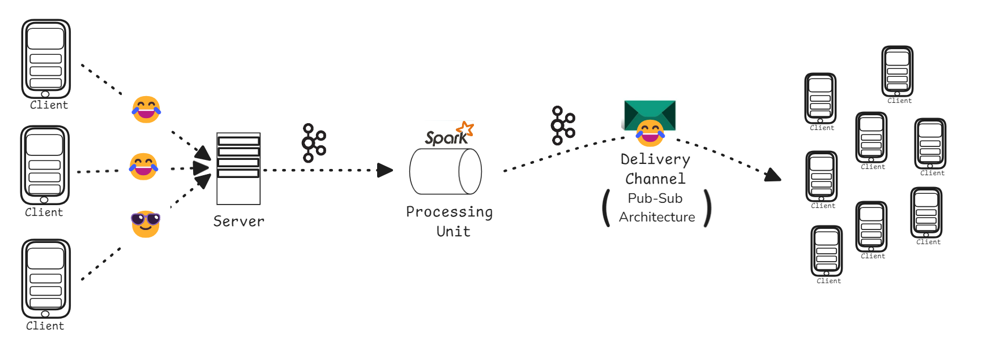
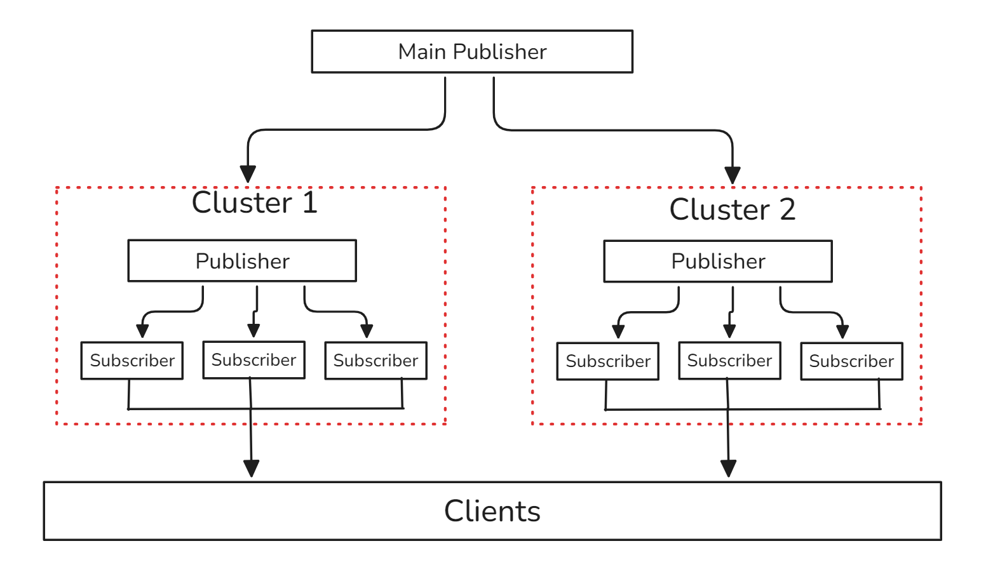

# Emostream

**Emostream** is a real-time, scalable emoji reaction system built for live streaming platforms like Hotstar. It captures billions of user-generated emojis during live events, processes them in real-time using distributed technologies, and streams meaningful visualizations back to viewers to boost engagement.

---

## 🚀 Features

- ⚡ Real-time emoji ingestion and processing
- 🧠 Spark Structured Streaming aggregation
- 🔁 Kafka-powered event pipelines
- 🌐 Scalable WebSocket & SSE-based emoji delivery
- 🧪 Unit & load tested for high concurrency
- 🔄 Horizontally scalable architecture
- 🛠️ Plug-and-play simulation via emoji generator

---

## 🏗️ Architecture Overview



## 🧰 Tech Stack

| Layer        | Tool/Framework         |
|--------------|------------------------|
| API          | Flask + Eventlet       |
| Messaging    | Apache Kafka           |
| Processing   | Apache Spark (Structured Streaming) |
| Realtime I/O | SSE, WebSocket         |
| Scaling      | Redis, Nginx           |
| Testing      | Pytest, Locust         |

---

## 📦 Project Structure

```
Emostream/
├── flasky.py                # Main Flask API server
├── main-publisher.py        # Publishes aggregated data
├── cluster-publisher.py     # Broadcasts data to subscribers
├── cluster-subscriber.py    # Client-facing real-time stream
├── spark-processing.py      # Spark Streaming job
├── emoji-generator.py       # Simulated emoji generator
├── client.py                # Client emoji sender
├── client_recieve.py        # Client emoji listener
├── locustfile.py            # Load testing with Locust
├── test_*.py                # Unit tests
```

---

## 🧪 Testing & Load Simulation

### ✅ Unit Tests

```bash
pytest test_flasky.py
pytest test_sendkafka.py
pytest test_sparkAgg.py
```

### 📈 Load Testing

```bash
locust -f locustfile.py
```

Then open [http://localhost:8089](http://localhost:8089) to simulate concurrent emoji senders.

---

## 🔧 Running the Project

### 1. Clone the Repo

```bash
git clone https://github.com/mokshablr/Emostream.git
cd Emostream
```

### 2. Start Kafka and Spark

- Ensure Kafka is running on localhost.
- Start the Spark job:

```bash
spark-submit --packages org.apache.spark:spark-sql-kafka-0-10_2.12:3.1.2 spark-processing.py
```

### 3. Start Flask API Servers

```bash
python flasky.py  # Add ports for scaling: flasky.py 5001, etc.
```

### 4. Launch Streaming Nodes

```bash
python main-publisher.py
python cluster-publisher.py
python cluster-subscriber.py
```

### 5. Simulate Emoji Input

```bash
python emoji-generator.py
```

### 6. Run a Listening Client

```bash
python client_recieve.py
```

---

## 📌 Use Cases

- 📊 Live emoji heatmaps for sports events
- 💬 Sentiment wave tracking during political debates
- 👨‍👩‍👧‍👦 Community engagement visualization on OTT platforms
- 🚀 Real-time dashboards for mass-scale viewer input

---

## 🔮 Future Enhancements

- NLP-based sentiment analytics
- Mobile client SDK
- Auto-scaling via Kubernetes
- UI dashboard for emoji trend graphs
